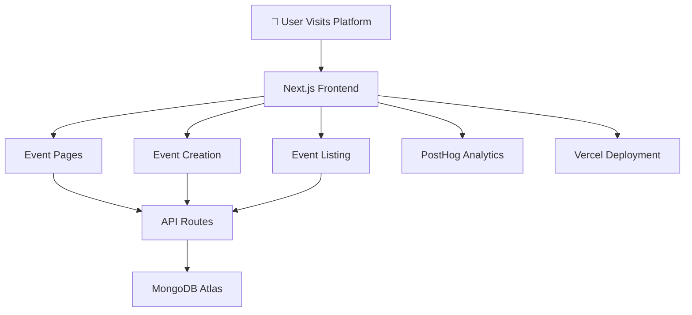

<div align="center">

# 🌐 DevEvents

### Modern Developer Event Discovery Platform built with Next.js 16

**A full-stack event discovery platform for developers to explore hackathons, bootcamps, meetups, and tech conferences worldwide.**
*Built with Next.js 16, MongoDB Atlas, PostHog analytics, and deployed on Vercel.*

<br>

[](https://nextjs.org/)
[](https://www.typescriptlang.org/)
[](https://www.mongodb.com/)
[](https://posthog.com/)
[](https://vercel.com/)
[]()

</div>

---

# 🌐 Live Demo

🚀 **Explore DevEvents here:**
👉 [https://marshmello-dev-events.vercel.app](https://marshmello-dev-events.vercel.app)

---

# 📖 What is DevEvents?

DevEvents is a **modern event discovery platform designed for developers** to easily find upcoming **hackathons, bootcamps, meetups, and technology conferences**.

The platform demonstrates a **production-ready Next.js architecture**, combining server-side rendering, scalable database integration, real-time analytics, and a clean modular codebase.

Users can:

* Discover upcoming developer events
* View detailed event pages
* Submit new events
* Browse events by categories and tags
* Track engagement analytics via PostHog

This project serves both as:

* a **developer utility platform**
* a **portfolio-level full-stack Next.js application**

---

# ✨ Features

| Feature                           | Description                                            |
| --------------------------------- | ------------------------------------------------------ |
| 🌍 **Event Discovery**            | Browse hackathons, meetups, bootcamps, and conferences |
| 🧾 **Detailed Event Pages**       | View event descriptions, schedule, and details         |
| ➕ **Submit Events**               | Users can create and publish events                    |
| 🏷 **Tag-based Categorization**   | Filter events by tags                                  |
| 📊 **Real-time Analytics**        | Track user behavior with PostHog                       |
| ⚡ **Modern Next.js Architecture** | Uses App Router and Server Components                  |
| 📱 **Responsive UI**              | Fully optimized for mobile and desktop                 |

---

# 🏗️ System Architecture

### Event Platform Architecture



---

# 🛠️ Technology Stack

### Frontend

| Component     | Technology           |
| ------------- | -------------------- |
| Framework     | `Next.js 16`         |
| Language      | `TypeScript`         |
| Styling       | `Tailwind CSS` / CSS |
| UI Components | `ShadCN UI`          |

---

### Backend

| Component      | Technology               |
| -------------- | ------------------------ |
| API Routes     | Next.js App Router       |
| Database       | MongoDB Atlas            |
| ORM            | Mongoose                 |
| Server Actions | Next.js Server Functions |

---

### DevOps & Tooling

| Component       | Technology              |
| --------------- | ----------------------- |
| Analytics       | PostHog                 |
| Deployment      | Vercel                  |
| IDE             | Google Anti-Gravity IDE |
| Version Control | Git + GitHub            |

---

# 📂 Project Structure

```text
DevEvents/
│
├── app/
│   ├── api/
│   │   └── events/
│   │       ├── route.ts
│   │       └── [slug]/
│   │           └── route.ts
│   │
│   ├── events/
│   │   ├── page.tsx
│   │   └── [slug]/
│   │       └── page.tsx
│   │
│   ├── layout.tsx
│   └── globals.css
│
├── components/
│   ├── Navbar.tsx
│   ├── EventCard.tsx
│   ├── EventDetails.tsx
│   ├── BookEvent.tsx
│   ├── ExploreBtn.tsx
│   └── LightRays.tsx
│
├── database/
│   ├── event.model.ts
│   ├── booking.model.ts
│   └── index.ts
│
├── lib/
│   ├── mongodb.ts
│   ├── constants.ts
│   └── actions/
│       ├── event.actions.ts
│       └── booking.actions.ts
│
├── public/
│   └── assets/
│
├── next.config.ts
├── package.json
└── README.md
```

---

# 🚀 Installation & Setup

### Prerequisites

* Node.js 18+
* MongoDB Atlas Database

---

# 1️⃣ Clone the Repository

```bash
git clone https://github.com/kishorekrrish3/DevEvents.git
cd DevEvents
```

---

# 2️⃣ Install Dependencies

```bash
npm install
```

---

# 3️⃣ Run Development Server

```bash
npm run dev
```

---

# 🌐 Local Development

Visit:

```
http://localhost:3000
```

---

# 🔐 Environment Variables

Create a `.env` file in the project root.

```env
NEXT_PUBLIC_POSTHOG_KEY=your_posthog_key
NEXT_PUBLIC_POSTHOG_HOST=your_posthog_host
NEXT_PUBLIC_BASE_URL=your_deployment_url
MONGODB_URI=your_mongodb_connection_string
CLOUDINARY_URL=your_cloudinary_url
```

---

# 📊 Analytics Integration

DevEvents integrates **PostHog analytics** for tracking:

* Page views
* Event interactions
* User engagement
* Conversion funnels
* Session replay heatmaps

---

# 🖼️ Screenshots

| Page          | Preview                   |
| ------------- | ------------------------- |
| Home Page     | `public/screenshot-1.png` |
| Event Details | `public/screenshot-2.png` |
| Event Listing | `public/screenshot-3.png` |

---

# 🚀 Deployment

The application is deployed on **Vercel**.

Deployment steps:

1. Push the repository to GitHub
2. Import project into Vercel
3. Add environment variables
4. Deploy

Vercel automatically optimizes the project for **Next.js performance and edge rendering**.

---

# 📚 References

This project is inspired by the **Next.js 16 Full Course** by JavaScript Mastery.

Resources used:

* Next.js Documentation
* MongoDB Atlas Documentation
* PostHog Analytics Docs
* Vercel Deployment Guide

---

# 🤝 Contributing

Contributions are welcome.

1. Fork the repository
2. Create a feature branch
3. Commit changes
4. Submit a pull request

---

# 👨‍💻 Author

**Kishore P**
AI & Full-Stack Developer
CSE (AI & Robotics) — VIT Chennai

---

<div align="center">

<br>

<i>Connecting developers to the events shaping the future of technology.</i>

<br><br>

**DevEvents** — discover, build, and connect.

</div>
